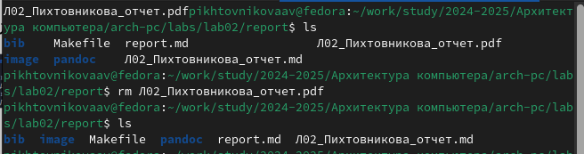

---
## Front matter
title: "Отчёт по лабораторной работе №3"
subtitle: "Дисциплина: архитектура компьютера"
author: "Алёна Владимировна Пихтовникова"

## Generic otions
lang: ru-RU
toc-title: "Содержание"

## Bibliography
bibliography: bib/cite.bib
csl: pandoc/csl/gost-r-7-0-5-2008-numeric.csl

## Pdf output format
toc: true # Table of contents
toc-depth: 2
lof: true # List of figures
fontsize: 12pt
linestretch: 1.5
papersize: a4
documentclass: scrreprt
## I18n polyglossia
polyglossia-lang:
  name: russian
  options:
	- spelling=modern
	- babelshorthands=true
polyglossia-otherlangs:
  name: english
## I18n babel
babel-lang: russian
babel-otherlangs: english
## Fonts
mainfont: IBM Plex Serif
romanfont: IBM Plex Serif
sansfont: IBM Plex Sans
monofont: IBM Plex Mono
mathfont: STIX Two Math
mainfontoptions: Ligatures=Common,Ligatures=TeX,Scale=0.94
romanfontoptions: Ligatures=Common,Ligatures=TeX,Scale=0.94
sansfontoptions: Ligatures=Common,Ligatures=TeX,Scale=MatchLowercase,Scale=0.94
monofontoptions: Scale=MatchLowercase,Scale=0.94,FakeStretch=0.9
mathfontoptions:
## Biblatex
biblatex: true
biblio-style: "gost-numeric"
biblatexoptions:
  - parentracker=true
  - backend=biber
  - hyperref=auto
  - language=auto
  - autolang=other*
  - citestyle=gost-numeric
## Pandoc-crossref LaTeX customization
figureTitle: "Рис."
tableTitle: "Таблица"
listingTitle: "Листинг"
lofTitle: "Список иллюстраций"
lolTitle: "Листинги"
## Misc options
indent: true
header-includes:
  - \usepackage{indentfirst}
  - \usepackage{float} # keep figures where there are in the text
  - \floatplacement{figure}{H} # keep figures where there are in the text
---

# Цель работы

Целью данной лабораторной работы является освоение процедуры оформления отчетов с помощью легковесного языка разметки Markdown.

# Задание

1. Установка необходимого ПО
2. Заполнение отчета по выполнению лабораторной работы №4 с помощью языка разметки Markdown
3. Задание для самостоятельной работы

# Теоретическое введение

Markdown - легковесный язык разметки, созданный с целью обозначения форматирования в простом тексте, с максимальным сохранением его читаемости человеком, и пригодный для машинного преобразования в языки для продвинутых публикаций. 
Внутритекстовые формулы делаются аналогично формулам LaTeX.
В Markdown вставить изображение в документ можно с помощью непосредственного указания адреса изображения.
Синтаксис Markdown для встроенной ссылки состоит из части [link text], представляющей текст гиперссылки, и части (file-name.md) – URL-адреса или имени файла, на который дается ссылка.
Markdown поддерживает как встраивание фрагментов кода в предложение, так и их размещение между предложениями в виде отдельных огражденных блоков. Огражденные блоки кода — это простой способ выделить синтаксис для фрагментов кода.

# Выполнение лабораторной работы

## Заполнение отчета по выполнению лабораторной работы №4 с помощью языка разметки Markdown

Открываю терминал. Перехожу в каталог курса, сформированный при выполненнии прошлой лаборатной работы (рис. [-@fig:01]).

{ #fig:01 width=70% }

Обновляю локальный репозиторий, скачав изменения из удаленного репозитория с помощью команды git pull. Команда не выполняется, так как была выполнена до, но не заскринина.(рис. [-@fig:02]).

{ #fig:02 width=70% } 

Перехожу в каталог с шаблоном отчета по лабораторной работе №4 с помощью cd (рис. [-@fig:03]).

{ #fig:03 width=70% }

Компилирую шаблон с использованием Makefile, вводя команду make (рис. [-@fig:04]).

{ #fig:04 width=70% }

Открываю сгенерированный файл report.docx LibreOffice (рис. [-@fig:05]).

{ #fig:05 width=70% }

Открываю сгенерированный файл report.pdf (рис. [-@fig:06]). Убедилась, что все правильно сгенерировалось.

{ #fig:06 width=70% }

Удаляю полученные файлы с использованием Makefile, вводя команду make clean (рис. [-@fig:07]). С помощью команды ls проверяю, удалились ли созданные файлы.

{ #fig:07 width=70% }

Открываю файл report.md с помощью любого текстового редактора mousepad (рис. [-@fig:08]).

{ #fig:08 width=70% }

Начинаю заполнять отчет с помощью языка разметки Markdown в скопированном файле (рис. [-@fig:09]).

{ #fig:09 width=70% }

Компилирую файл с отчетом. Загружаю отчет на GitHub.

## Задание для самостоятельной работы

1. Перехожу в директорию lab02/report с помощью cd, чтобы там заполнять отчет по второй лабораторной работе (рис. [-@fig:019]).

{ #fig:019 width=70% }

Копирую файл report.md с новым именем для заполненния отчета (рис. [-@fig:020]).

{ #fig:020 width=70% }

Открываю файл с помощью текстового редактора mousepad и начинаю заполнять отчет (рис. [-@fig:021]).

{ #fig:021 width=70% }

Удаляю предыдущий файл отчета, чтобы при компиляции он мне не мешал (рис. [-@fig:022]).

{ #fig:022 width=70% }

Компилирую файл с отчетом по лабораторной работе (рис. [-@fig:023]).

{ #fig:023 width=70% }

2. Удаляю лишние сгенерированные файлы report.docx и report.pdf ([-@fig:024]).

{ #fig:024 width=70% }

Добавляю изменения на GitHub с помощью комнадой git add и сохраняю изменения с помощью commit ([-@fig:025]).

{ #fig:025 width=70% }

Отправлялю файлы на сервер с помощью команды git pull ([-@fig:026]).

{ #fig:026 width=70% }

# Выводы

В результате выполнения данной лабораторной работы я освоила процедуры оформления отчетов с помощью легковесного языка разметки Markdown.

# Список литературы

1. [Архитектура ЭВМ](https://esystem.rudn.ru/pluginfile.php/2089083/mod_resource/content/0/%D0%9B%D0%B0%D0%B1%D0%BE%D1%80%D0%B0%D1%82%D0%BE%D1%80%D0%BD%D0%B0%D1%8F%20%D1%80%D0%B0%D0%B1%D0%BE%D1%82%D0%B0%20%E2%84%963.%20%D0%AF%D0%B7%D1%8B%D0%BA%20%D1%80%D0%B0%D0%B7%D0%BC%D0%B5%D1%82%D0%BA%D0%B8%20.pdf)
